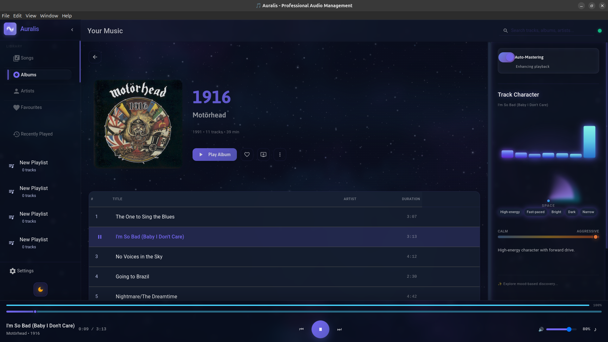
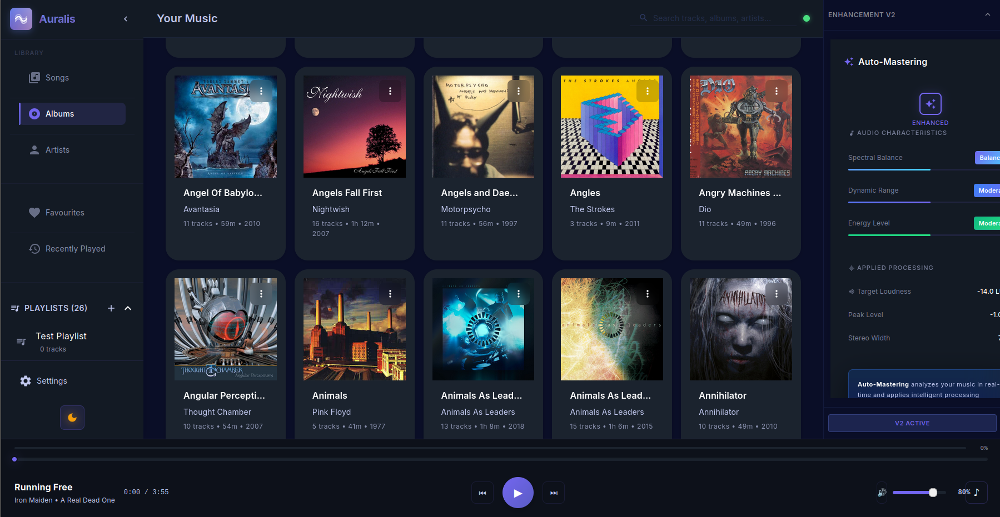

# 🎵 Auralis - Your Music Player with Magical Audio Enhancement

**A beautiful music player that makes your music sound better - automatically.**

Simple like iTunes. Smart like a mastering studio. No complicated settings.

[](LICENSE)
[]()
[](https://github.com/matiaszanolli/Auralis/releases)
[]()
[]()
[]()
[]()

## 📦 Current Version: 1.2.1-beta.2

**🎵 Production-Ready Desktop Release**

This release focuses on **stability and reliability** with critical concurrency fixes:

### Downloads

| Platform | Download | Notes |
|----------|----------|-------|
| **Linux** | [AppImage](https://github.com/matiaszanolli/Auralis/releases) | Universal, make executable and run |
| **Linux** | [.deb](https://github.com/matiaszanolli/Auralis/releases) | Debian/Ubuntu: `sudo dpkg -i <file>` |
| **Windows** | [.exe](https://github.com/matiaszanolli/Auralis/releases) | Run installer |
| **macOS** | [.dmg](https://github.com/matiaszanolli/Auralis/releases) | Drag to Applications |

### Highlights

- 🔒 **Database Concurrency Fix (CRITICAL)** - Inter-process locking prevents corruption (#2067)
  - Multiple processes can now safely start simultaneously
  - Migration aborts if backup fails (prevents data loss)
  - Platform-specific file locking (fcntl/msvcrt)
- ✅ **Seamless Audio Playback** - Equal-power crossfade between mastering chunks
  - Eliminates audible artifacts at chunk boundaries
  - 15s chunks with 5s overlap crossfade for smooth transitions
- ✅ **Parallel DSP Processing** - Prevents spectral loss and phase cancellation
  - Sub-bass control, EQ, and mastering use parallel processing
  - Maintains audio quality across processing pipeline
- ✅ **High-Performance Rust DSP** - 2-5x faster audio analysis via PyO3 bindings
  - HPSS (Harmonic/Percussive Separation), YIN pitch detection, Chroma analysis
  - 25D audio fingerprinting in ~500ms per track
- ✅ **Improved Mastering Algorithm** - Energy-adaptive LUFS targeting
  - Content-aware processing adapts to source characteristics
  - 5 enhancement presets: Adaptive, Gentle, Warm, Bright, Punchy
- ✅ **Comprehensive Test Suite** - ~5,100 backend tests with concurrency coverage
  - 6 new tests for database migration race conditions
  - Multiprocessing tests for true parallel execution verification
- ✅ **Automated CI/CD** - GitHub Actions builds for Linux, Windows, macOS

📖 **[Release Notes](docs/releases/CHANGELOG.md)** | 🔗 **[Roadmap](docs/MASTER_ROADMAP.md)**

### 🎯 Previous Releases

- **[v1.1.0-beta.5](https://github.com/matiaszanolli/Auralis/releases/tag/v1.1.0-beta.5)** - Audio mastering refinement (Dec 2025)
- **[v1.1.0-beta.3](https://github.com/matiaszanolli/Auralis/releases/tag/v1.1.0-beta.3)** - DRY refactoring & code quality (Nov 2025)
- **[v1.0.0-beta.12](https://github.com/matiaszanolli/Auralis/releases/tag/v1.0.0-beta.12)** - Previous stable release with binaries

---

📚 **[Master Roadmap](docs/MASTER_ROADMAP.md)** | 🏗️ **[Architecture Guide](CLAUDE.md)** | ⚡ **[Performance Optimizations](docs/optimization/CRITICAL_OPTIMIZATIONS_IMPLEMENTED.md)** | 📊 **[Test Guidelines](docs/development/TESTING_GUIDELINES.md)** | 📖 **[Developer Docs](docs/README.md)**

---

## ✨ What is Auralis?

Auralis is a **local music player** with professional audio enhancement built-in. Play your music collection with a simple toggle to make it sound better.

**Think:** iTunes meets audio mastering - but simple enough for anyone to use.

### Key Features

- 🎵 **Beautiful Music Player** - Clean, modern interface inspired by Spotify and iTunes
- ✨ **Magical Audio Enhancement** - One-click toggle for professional audio mastering
- 📁 **Library Management** - Scan folders, organize your collection, search instantly
- 🎨 **Audio Visualizer** - Watch your music come alive with real-time visualization
- 🖥️ **Desktop & Web** - Native Electron app or run in your browser
- 🔒 **100% Private** - Your music, your computer, no cloud required
- ⚡ **Blazing Fast** - 36.6x real-time audio processing, 740+ files/second scanning
- ✅ **Well Tested** - ~5,100 automated backend tests, production-ready quality, comprehensive test suite

---

## 🚀 Quick Start

### Option 1: Download Binary (Recommended)

Download the latest release from [GitHub Releases](https://github.com/matiaszanolli/Auralis/releases):

**Windows:**
```bash
# 1. Download Auralis-Setup-1.2.1-beta.2.exe
# 2. Run the installer
# 3. Launch Auralis from Start Menu
```

**Linux (AppImage):**
```bash
# 1. Download Auralis-1.2.1-beta.2.AppImage
chmod +x Auralis-1.2.1-beta.2.AppImage
./Auralis-1.2.1-beta.2.AppImage
```

**Linux (Debian/Ubuntu):**
```bash
# 1. Download auralis_1.2.1-beta.2_amd64.deb
sudo dpkg -i auralis_1.2.1-beta.2_amd64.deb
auralis
```

**macOS:**
```bash
# 1. Download Auralis-1.2.1-beta.2.dmg
# 2. Open the DMG and drag Auralis to Applications
# 3. First launch: Right-click → Open (to bypass Gatekeeper)
```

### Option 2: Run from Source (Development)

**Web Interface:**
```bash
# 1. Install dependencies
pip install -r requirements.txt

# 2. Launch Auralis
python launch-auralis-web.py

# 3. Open browser at http://localhost:8765
```

**Desktop App:**
```bash
# 1. Install Python + Node.js dependencies
pip install -r requirements.txt
cd desktop && npm install

# 2. Launch desktop app
npm run dev
```

---

## 📸 Screenshots

### Album Detail View
View album details with track listings, metadata, and integrated audio enhancement controls.



### Albums Grid View
Beautiful grid layout of your music collection with album artwork and metadata.



---

## 🎯 How to Use

### 1. Add Your Music

**Desktop App:**
- Click the **📁 Scan Folder** button
- Native folder picker opens
- Browse to your music folder
- Click "Select Folder"
- Done! ✅

**Web Interface:**
- Click the **📁 Scan Folder** button
- Type your music folder path (e.g., `/home/user/Music`)
- Press OK
- Done! ✅

### 2. Play Music

- Browse your library (grid or list view)
- Click any track to play
- Use player controls at bottom
- That's it!

### 3. Enable Magic Enhancement

- While playing any song
- Look at bottom-right of player
- Toggle the **✨ Magic** switch
- Hear instant audio enhancement!

**No settings, no presets, no complexity. Just better sound.**

---

## 🎛️ What Makes It Different?

### vs. iTunes/Music.app
- ✅ Works with your local files (no cloud required)
- ✅ Built-in audio enhancement (no plugins needed)
- ✅ Cross-platform (Linux, macOS, Windows)
- ❌ No streaming service (local files only)

### vs. Spotify Desktop
- ✅ Owns your music (no subscription needed)
- ✅ Better sound quality (lossless local files)
- ✅ Audio enhancement built-in
- ❌ No online streaming (your files only)

### vs. VLC/foobar2000
- ✅ Modern, beautiful interface
- ✅ Simple to use (no learning curve)
- ✅ One-click audio enhancement
- ❌ Less advanced customization

**Perfect for:** People who care about sound quality but don't want complexity.

---

## 🔧 Supported Audio Formats

### Input (Playback)
WAV, FLAC, MP3, OGG, M4A, AAC, WMA

### Output (Export)
WAV (16-bit/24-bit PCM), FLAC (16-bit/24-bit PCM)

---

## 🏗️ Architecture

### Simple Two-Tab Interface
1. **Your Music** - Library browser with search and grid/list view
2. **Visualizer** - Real-time audio visualization

### Technology Stack

**Backend (Python):**
- FastAPI for REST API
- SQLite for library database
- Professional DSP algorithms
- Real-time audio processing

**Frontend (React):**
- Material-UI components
- WebSocket for live updates
- Responsive design
- Modern UX

**Desktop (Electron):**
- Native OS integration
- System tray support
- Auto-updates ready

```
auralis/                    # Core audio processing engine
├── core/                   # Mastering algorithms
├── dsp/                    # Digital signal processing
├── analysis/               # Audio analysis tools
├── library/                # SQLite library management
├── player/                 # Audio playback engine
└── io/                     # Multi-format audio I/O

auralis-web/               # Web & Desktop UI
├── backend/               # FastAPI server (REST + WebSocket, :8765)
│   ├── main.py           # App entry point
│   └── routers/          # 19 route handlers
└── frontend/              # React app
    └── src/
        ├── components/    # UI components (library, player, visualizer)
        ├── hooks/         # Domain hooks (player, library, enhancement, websocket)
        ├── store/         # Redux slices
        └── design-system/ # Design tokens (single source of truth)

desktop/                   # Electron wrapper
├── main.js               # Main process
├── preload.js            # IPC bridge
└── package.json          # Desktop config
```

---

## 🧪 Testing & Quality

**~5,100 automated backend tests** ensure production-ready quality:

- **Backend (Python):** ~5,100 tests covering audio processing, API, security
- **Frontend (React):** Component and integration tests with Vitest
- **Security:** OWASP Top 10 coverage (SQL injection, XSS, etc.)

### Run Tests

```bash
# Backend tests
python -m pytest tests/ -v

# Skip slow tests
python -m pytest -m "not slow" -v

# Frontend tests
cd auralis-web/frontend
npm test

# With coverage
python -m pytest tests/ --cov=auralis --cov-report=html
```

See [TESTING_GUIDELINES.md](docs/development/TESTING_GUIDELINES.md) for testing philosophy and standards.

### Build Desktop App

```bash
cd desktop

# Development mode
npm run dev

# Build for all platforms
npm run package

# Build for specific platform
npm run package:linux
npm run package:win
npm run package:mac
```

### Frontend Development

```bash
cd auralis-web/frontend

# Install dependencies
npm install

# Development server (hot reload)
npm start

# Build for production
npm run build
```

---

## 📚 Documentation

### Essential Docs
- **[MASTER_ROADMAP.md](docs/MASTER_ROADMAP.md)** - Complete project roadmap
- **[CLAUDE.md](CLAUDE.md)** - Full technical reference (for developers)
- **[User Guide](docs/getting-started/BETA_USER_GUIDE.md)** - Complete user guide

### Testing Documentation
- **[TESTING_GUIDELINES.md](docs/development/TESTING_GUIDELINES.md)** - **MANDATORY** - Test quality principles
- **[AUTOMATED_TESTING_GUIDE.md](docs/development/AUTOMATED_TESTING_GUIDE.md)** - Automated testing workflow
- **[TEST_EXECUTION_GUIDE.md](docs/development/TEST_EXECUTION_GUIDE.md)** - How to run the test suites

### Release Notes
- **[CHANGELOG](docs/releases/CHANGELOG.md)** - Full version history
- **[All Release Notes](docs/releases/)** - Per-release notes archive

---

## 🎯 Roadmap

### ✅ Recently Completed

**v1.2.0-beta.3** (February 2026):
- [x] **CRITICAL FIX**: Database migration concurrency (#2067)
  - Inter-process file locking prevents race conditions
  - Fail-fast on backup failure (prevents data loss)
  - Double-check pattern after lock acquisition
  - 6 comprehensive concurrency tests
- [x] Seamless audio playback with equal-power crossfade
  - Eliminates artifacts at chunk boundaries
  - 5-second overlap between 15-second chunks
- [x] Parallel processing for audio DSP
  - Sub-bass control, EQ, mastering use parallel processing
  - Prevents spectral loss and phase cancellation
- [x] 6 audit slash commands for code quality
  - `/audit-search`, `/audit-security`, `/audit-regression`
  - `/audit-concurrency`, `/audit-integration`, `/audit-incremental`

**v1.2.0-beta.1** (December 2025):
- [x] macOS binaries (.dmg) - First macOS release
- [x] High-performance Rust DSP via PyO3 (2-5x faster)
- [x] Energy-adaptive LUFS mastering algorithm
- [x] Enhanced playback mode with real-time streaming
- [x] Automated CI/CD for all platforms

**v1.1.x Series** (Oct-Dec 2025):
- [x] 25D audio fingerprinting system
- [x] 850+ automated tests
- [x] Unified streaming architecture
- [x] Query caching (136x speedup)

### 🔄 In Progress

**v1.2.0 Stable:**
- [ ] macOS code signing for Gatekeeper
- [ ] Enhancement presets UI (5 presets ready in backend)
- [ ] Export enhanced audio to file

### 📋 Planned

**v1.3.0:**
- [ ] Album art downloader
- [ ] Dark/light theme toggle
- [ ] Lyrics display
- [ ] Mini player mode

---

## ❓ FAQ

### Q: Is Auralis free?
**A:** Yes! Open source under AGPL-3.0 for personal, research, and open-source use. A commercial license is available for proprietary/closed-source use — see [COMMERCIAL_LICENSE.md](COMMERCIAL_LICENSE.md).

### Q: Does it work offline?
**A:** Yes, 100% local. No internet required after installation.

### Q: What does "Magic" enhancement do?
**A:** Professional audio mastering - balances levels, enhances dynamics, improves clarity. All automatic.

### Q: Will it modify my original files?
**A:** No! Enhancement is applied in real-time during playback only. Your files are never changed.

### Q: Can I export enhanced versions?
**A:** Not yet, but planned for v1.2.0 stable.

### Q: Why is it called Auralis?
**A:** "Aura" (atmosphere/feeling) + "Audio" = Auralis. The magical aura of your music.

### Q: How is this different from EQ?
**A:** Much more sophisticated - dynamic range optimization, frequency balancing, psychoacoustic EQ, intelligent limiting. Think mastering studio, not just treble/bass knobs.

---

## 🐛 Known Issues (v1.2.1-beta.2)

### ⚠️ Current Limitations

**macOS Code Signing**
- macOS builds trigger Gatekeeper warnings (not code-signed)
- **Workaround:** Right-click → Open on first launch
- **Status:** Code signing planned for v1.2.0 stable

**Preset Switching Delay**
- 2-5 second pause when changing presets during playback
- **Workaround:** Select preset before starting playback

### ✅ Recently Fixed

**v1.2.1-beta.2** (February 2026):
- **Database migration race condition (CRITICAL)** - Inter-process locking prevents corruption
- **Chunk boundary artifacts** - Equal-power crossfade for seamless playback
- **Spectral loss in mastering** - Parallel processing preserves audio quality

**v1.2.0-beta.1** (December 2025):
- **Audio position jumps** - Buffer management improvements
- **Buffer underruns** - Health monitoring prevents cascades
- **Backward audio jumps** - Chunk overlap bug resolved
- **WebSocket disconnects** - Proper state cleanup on reconnection

---

## 🤝 Contributing

We welcome contributions! Here's how:

1. **Fork** the repository
2. **Create** a feature branch: `git checkout -b feature/amazing-feature`
3. **Commit** your changes: `git commit -m 'Add amazing feature'`
4. **Push** to the branch: `git push origin feature/amazing-feature`
5. **Open** a Pull Request

### Development Guidelines
- Keep it simple (music player first, not a DAW)
- Maintain the clean 2-tab UI
- Write tests for new features
- Update documentation

---

## 📄 License

Auralis is dual-licensed:

- **Open Source:** [AGPL-3.0](LICENSE) — free for personal use, research, education, and open-source projects.
- **Commercial:** For proprietary, embedded, or closed-source commercial use, a commercial license is required. See [COMMERCIAL_LICENSE.md](COMMERCIAL_LICENSE.md) or contact contacto@matiaszanolli.com.

### What This Means for Open-Source Users
- ✅ Free to use, modify, and distribute
- ✅ Can use in open-source commercial projects
- ✅ Must keep source code open if distributed or deployed as a network service
- ✅ Must use same license (AGPL-3.0) for derivatives

---

## 🙏 Acknowledgments

- **Matchering 2.0** - Original audio processing algorithms
- **FastAPI** - Modern Python web framework
- **React & Material-UI** - Beautiful UI components
- **Electron** - Cross-platform desktop apps
- **All contributors** - Making Auralis better every day

---

## 💬 Community

- **Issues:** [GitHub Issues](https://github.com/matiaszanolli/Auralis/issues)
- **Discussions:** [GitHub Discussions](https://github.com/matiaszanolli/Auralis/discussions)
- **Email:** [Project Maintainer](mailto:contacto@matiaszanolli.com)

---

## 🎵 Philosophy

> **"The best music player is the one you actually enjoy using."**

We believe:
- Music should sound great without complicated settings
- Beautiful design matters
- Privacy is important (your music, your computer)
- Simple is better than complex
- Open source builds trust

---

**Made with ❤️ by music lovers, for music lovers.**

**🎵 Rediscover the magic in your music.**
