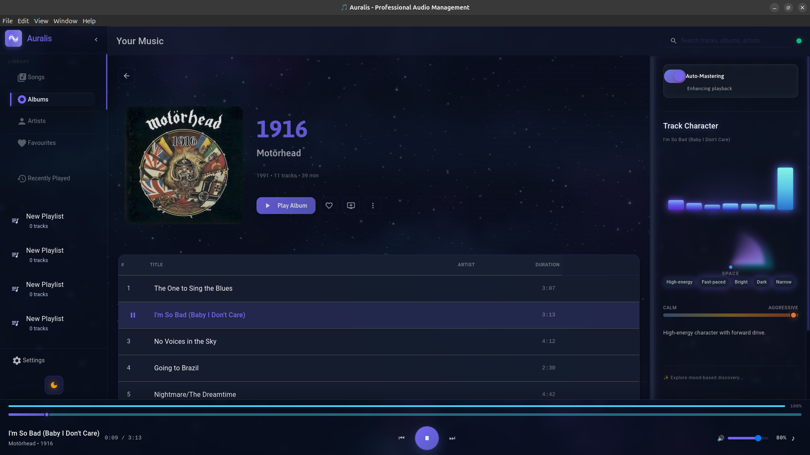
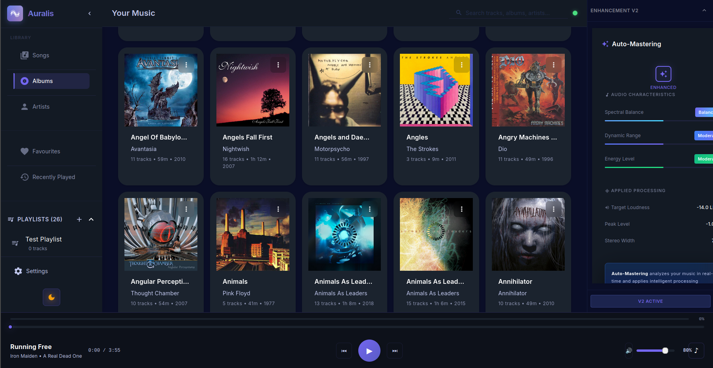

# 🎵 Auralis - Your Music Player with Magical Audio Enhancement

**A beautiful music player that makes your music sound better - automatically.**

Simple like iTunes. Smart like a mastering studio. No complicated settings.

[](LICENSE)
[]()
[-orange.svg)](docs/releases/RELEASE_NOTES_1_5_1.md)
[]()
[]()
[]()
[]()

## 🚧 Recovery in progress: v1.5.1

> **Not yet release-ready.** v1.5.1 is an unreleased recovery milestone on `master`.
> It has not been tagged, built, or published. The version number marks the workstream; it is
> not a claim that the application is currently working end to end.

The [working-state recovery audit](docs/audits/AUDIT_RECOVERY_2026-07-24.md) found that the
backend can boot and the frontend can build, but the supported full-app launch path and three
core product flows still have release-blocking defects. The immediate goal is deliberately
smaller than “finished”: one truthful launcher, a fresh library that persists fingerprints,
mono-safe enhancement, and deterministic rapid track selection.

### Downloads

> ⚠️ **No v1.5.1 binaries exist.** The last release with downloadable binaries is
> **v1.2.0-beta.2** (Dec 2025), several months behind `master`. Do not publish or distribute a
> v1.5.1 build until the [release checklist](docs/releases/RELEASE_CHECKLIST_1_5_1.md) is green.

| Platform | Download (v1.2.0-beta.2) | Notes |
|----------|----------|-------|
| **Linux** | [AppImage](https://github.com/matiaszanolli/Auralis/releases/tag/v1.2.0-beta.2) | Universal, make executable and run |
| **Linux** | [.deb](https://github.com/matiaszanolli/Auralis/releases/tag/v1.2.0-beta.2) | Debian/Ubuntu: `sudo dpkg -i <file>` |
| **Windows** | [.exe](https://github.com/matiaszanolli/Auralis/releases/tag/v1.2.0-beta.2) | Run installer |
| **macOS** | [.dmg](https://github.com/matiaszanolli/Auralis/releases/tag/v1.2.0-beta.2) | Drag to Applications |

### Release Verification

> ⚠️ **Release binaries are not code-signed yet** (#4905) — no Windows Authenticode or macOS
> Developer ID certificate is wired into the build. `electron-updater`'s own Windows
> publisher-match check (`verifyUpdateCodeSignature`) is explicitly disabled, and macOS
> `hardenedRuntime`/Gatekeeper assessment are off. Until real certificates are obtained, treat
> auto-update and downloaded binaries as verified only by the checksum/signature below — not by
> platform code-signing.
>
> Each release's `SHA256SUMS.txt` is GPG-signed (`SHA256SUMS.txt.asc`) once the repository's
> release signing key is provisioned. **Key fingerprint: TBD** — not yet published, since the
> key has not been generated/rotated into CI secrets. Verify with:
> ```
> gpg --verify SHA256SUMS.txt.asc SHA256SUMS.txt
> sha256sum -c SHA256SUMS.txt
> ```
> A release published without a valid `SHA256SUMS.txt.asc` should be treated as unverified.

### What this recovery start establishes

- ✅ **Evidence-based recovery scope** — one deduplicated audit separates launcher, product,
  verification, and lower-priority debt.
- ✅ **Usable foundations** — the FastAPI backend boots and serves real API requests, and the
  React production bundle builds.
- ✅ **Consistent release identity** — Python, backend, package, frontend, desktop, and
  packaging metadata now agree on v1.5.1.
- 🚧 **Explicit release gate** — four high-severity recovery findings must be fixed and
  smoke-tested before a tag is created.
- 📜 **Preserved history** — the large v1.5.0 source-preparation entry remains in the
  changelog, but local git history confirms it was never tagged as a release.

📖 **[v1.5.1 Release Notes](docs/releases/RELEASE_NOTES_1_5_1.md)** |
✅ **[Release Checklist](docs/releases/RELEASE_CHECKLIST_1_5_1.md)** |
🔗 **[Recovery Audit](docs/audits/AUDIT_RECOVERY_2026-07-24.md)** |
🎨 **[Desktop UI Theme Audit](docs/audits/UI_THEME_UNIFICATION_2026-07-25.md)**

### 🎯 Previous Releases

- **[v1.2.0-beta.2](https://github.com/matiaszanolli/Auralis/releases/tag/v1.2.0-beta.2)** - Last binary release; AppImage size optimization (Dec 2025)
- **[v1.1.0-beta.5](https://github.com/matiaszanolli/Auralis/releases/tag/v1.1.0-beta.5)** - Audio mastering refinement (Dec 2025)
- **[v1.1.0-beta.3](https://github.com/matiaszanolli/Auralis/releases/tag/v1.1.0-beta.3)** - DRY refactoring & code quality (Nov 2025)
- **[v1.0.0-beta.12](https://github.com/matiaszanolli/Auralis/releases/tag/v1.0.0-beta.12)** - Earlier beta release with binaries

---

📚 **[Master Roadmap](docs/MASTER_ROADMAP.md)** | 🏗️ **[Architecture Guide](CLAUDE.md)** | ⚡ **[Performance Optimizations](docs/optimization/CRITICAL_OPTIMIZATIONS_IMPLEMENTED.md)** | 📊 **[Test Guidelines](docs/development/TESTING_GUIDELINES.md)** | 📖 **[Developer Docs](docs/README.md)**

---

## ✨ What is Auralis?

Auralis is a **local music player** with professional audio enhancement built-in. Play your music collection with a simple toggle to make it sound better.

**Think:** iTunes meets audio mastering - but simple enough for anyone to use.

### Key Features

- 🎵 **Beautiful Music Player** - Clean, modern interface inspired by Spotify and iTunes
- ✨ **Magical Audio Enhancement** - One-click toggle for professional audio mastering
- 📁 **Library Management** - Scan folders, organize your collection, search instantly
- 🎨 **Audio Visualizer** - Watch your music come alive with real-time visualization
- 🖥️ **Desktop Application** - Electron releases for Linux, Windows, and macOS Apple Silicon
- 🔒 **100% Private** - Your music, your computer, no cloud required
- ⚡ **Blazing Fast** - 36.6x real-time audio processing, 740+ files/second scanning
- 🧪 **Broadly Tested** - large backend and frontend suites exist; the recovery audit documents
  the currently trustworthy green slices and the stale/red gates

---

## 🚀 Quick Start

### Option 1: Download Binary (last binary release: v1.2.0-beta.2)

Several months behind `master` — see the note above. Download from [GitHub Releases](https://github.com/matiaszanolli/Auralis/releases):

**Windows:**
```bash
# 1. Download Auralis.Setup.1.2.0-beta.2.exe
# 2. Run the installer
# 3. Launch Auralis from Start Menu
```

**Linux (AppImage):**
```bash
# 1. Download Auralis-1.2.0-beta.2.AppImage
chmod +x Auralis-1.2.0-beta.2.AppImage
./Auralis-1.2.0-beta.2.AppImage
```

**Linux (Debian/Ubuntu):**
```bash
# 1. Download auralis-desktop_1.2.0-beta.2_amd64.deb
sudo dpkg -i auralis-desktop_1.2.0-beta.2_amd64.deb
auralis
```

**macOS:**
```bash
# 1. Download Auralis-1.2.0-beta.2.dmg (or -arm64.dmg for Apple Silicon)
# 2. Open the DMG and drag Auralis to Applications
# 3. First launch: Right-click → Open (to bypass Gatekeeper)
```

### Option 2: Run the verified components from source

The root launcher and Electron development orchestration are currently blocked by
[REC-01](docs/audits/AUDIT_RECOVERY_2026-07-24.md#rec-01-there-is-no-usable-single-owner-application-launcher).
For recovery work, run the backend and Vite separately:

**One-time setup:**

```bash
# --python-preference only-managed: without it uv can silently pick a
# stale pyenv shim instead of the interpreter .python-version pins.
uv venv --python-preference only-managed
source .venv/bin/activate
uv pip install -r requirements.txt
cd vendor/auralis-dsp
maturin develop
cd ../..
cd auralis-web/frontend
pnpm install --frozen-lockfile
```

**Terminal 1 — backend:**

```bash
source .venv/bin/activate
cd auralis-web/backend
python main.py --dev
```

**Terminal 2 — frontend:**

```bash
cd auralis-web/frontend
pnpm run dev
```

Open <http://localhost:3000> only as an **unsupported browser preview** for renderer
development. It is not an official Auralis platform and does not clear the desktop release
gate. Electron remains the supported product surface and embeds this same React bundle.

---

## 📸 Screenshots

### Album Detail View
View album details with track listings, metadata, and integrated audio enhancement controls.



### Albums Grid View
Beautiful grid layout of your music collection with album artwork and metadata.



---

## 🎯 How to Use

### 1. Add Your Music

**Desktop App:**
- Click the **📁 Scan Folder** button
- Native folder picker opens
- Browse to your music folder
- Click "Select Folder"
- Done! ✅

### 2. Play Music

- Browse your library (grid or list view)
- Click any track to play
- Use player controls at bottom
- That's it!

### 3. Enable Magic Enhancement

- While playing any song
- Look at bottom-right of player
- Toggle the **✨ Magic** switch
- Hear instant audio enhancement!

**No settings, no presets, no complexity. Just better sound.**

---

## 🎛️ What Makes It Different?

### vs. iTunes/Music.app
- ✅ Works with your local files (no cloud required)
- ✅ Built-in audio enhancement (no plugins needed)
- ✅ Cross-platform (Linux, macOS, Windows)
- ❌ No streaming service (local files only)

### vs. Spotify Desktop
- ✅ Owns your music (no subscription needed)
- ✅ Better sound quality (lossless local files)
- ✅ Audio enhancement built-in
- ❌ No online streaming (your files only)

### vs. VLC/foobar2000
- ✅ Modern, beautiful interface
- ✅ Simple to use (no learning curve)
- ✅ One-click audio enhancement
- ❌ Less advanced customization

**Perfect for:** People who care about sound quality but don't want complexity.

---

## 🔧 Supported Audio Formats

### Input (Playback)
WAV, FLAC, MP3, OGG, M4A, AAC, WMA

### Output (Export)
WAV (16-bit/24-bit PCM), FLAC (16-bit/24-bit PCM)

---

## 🏗️ Architecture

### Simple Two-Tab Interface
1. **Your Music** - Library browser with search and grid/list view
2. **Visualizer** - Real-time audio visualization

### Technology Stack

**Backend (Python):**
- FastAPI for REST API + WebSocket streaming
- SQLite for library database
- Professional DSP algorithms (Rust via PyO3 + NumPy)
- Real-time audio processing

**Desktop renderer (React):**
- Material-UI components + a custom design-token system
- WebSocket for live updates
- Desktop-first adaptive layout
- Modern UX

**Desktop (Electron):**
- Native OS integration
- System tray support
- Auto-updates ready

```
auralis/                    # Core audio processing engine
├── core/                   # Mastering algorithms
├── dsp/                    # Digital signal processing
├── analysis/               # Audio analysis tools
├── library/                # SQLite library management
├── player/                 # Audio playback engine
└── io/                     # Multi-format audio I/O

auralis-web/               # Shared desktop renderer + local backend
├── backend/               # FastAPI server (REST + WebSocket, :8765)
│   ├── main.py           # App entry point
│   └── routers/          # 18 route handlers
└── frontend/              # React app
    └── src/
        ├── components/    # UI components (library, player, visualizer)
        ├── hooks/         # Domain hooks (player, library, enhancement, websocket)
        ├── store/         # Redux slices
        └── design-system/ # Design tokens (single source of truth)

desktop/                   # Electron wrapper
├── main.js               # Main process
├── preload.js            # IPC bridge
└── package.json          # Desktop config
```

---

## 🧪 Testing & Quality

The repository contains roughly 5,400 backend and 3,500 frontend tests. The complete suites
are not currently green; use the recovery audit and release checklist to distinguish
trustworthy gates from known harness drift.

- **Backend (Python):** ~5,400 tests covering audio processing, API, security
- **Frontend (React):** ~3,500 component and integration tests with Vitest
- **Security:** OWASP Top 10 coverage (SQL injection, XSS, etc.)

### Run Tests

```bash
# Backend tests
python -m pytest tests/ -v

# Skip slow tests
python -m pytest -m "not slow" -v

# Frontend tests
cd auralis-web/frontend
pnpm run test:run

# With coverage
python -m pytest tests/ --cov=auralis --cov-report=html
```

See [TESTING_GUIDELINES.md](docs/development/TESTING_GUIDELINES.md) for testing philosophy and standards.

### Build Desktop App

```bash
cd desktop

# Development mode
pnpm run dev

# Build for the current target
pnpm run build:linux
pnpm run build:win
pnpm run build:mac:arm64
```

### Desktop Renderer Development

```bash
cd auralis-web/frontend

# Install dependencies
pnpm install --frozen-lockfile

# Unsupported browser preview for hot reload
pnpm run dev

# Build for production
pnpm run build
```

The Vite URL is a developer preview, not a deployable or supported web edition. Product
validation must run through Electron, where native folder selection, process ownership, and
desktop lifecycle behavior are available.

---

## 📚 Documentation

### Essential Docs
- **[MASTER_ROADMAP.md](docs/MASTER_ROADMAP.md)** - Complete project roadmap and what's actually shipped
- **[CLAUDE.md](CLAUDE.md)** - Full technical reference (for developers)
- **[User Guide](docs/getting-started/BETA_USER_GUIDE.md)** - Complete user guide (describes v1.0.0-beta.1; download filenames/screenshots are stale — current binary is v1.2.0-beta.2, see the release table above)

### Testing Documentation
- **[TESTING_GUIDELINES.md](docs/development/TESTING_GUIDELINES.md)** - **MANDATORY** - Test quality principles
- **[AUTOMATED_TESTING_GUIDE.md](docs/development/AUTOMATED_TESTING_GUIDE.md)** - Automated testing workflow
- **[TEST_EXECUTION_GUIDE.md](docs/development/TEST_EXECUTION_GUIDE.md)** - How to run the test suites

### Release Notes
- **[CHANGELOG](docs/releases/CHANGELOG.md)** - Full version history
- **[v1.5.1 release notes](docs/releases/RELEASE_NOTES_1_5_1.md)** - Recovery scope and known blockers
- **[v1.5.1 release checklist](docs/releases/RELEASE_CHECKLIST_1_5_1.md)** - Tag/publish gates
- **[All Release Notes](docs/releases/)** - Per-release notes archive

---

## 🎯 Roadmap

This section is a brief summary — **[MASTER_ROADMAP.md](docs/MASTER_ROADMAP.md)** is the detailed, actively-maintained source of truth (current state, open backlog, longer-term vision).

### 🚧 v1.5.1 recovery milestone

- [x] Deep working-state audit and prioritized recovery plan
- [x] Version metadata aligned on 1.5.1
- [x] Release notes and acceptance checklist prepared
- [ ] Repair the canonical launcher and readiness checks
- [ ] Repair fresh-database fingerprint persistence
- [ ] Repair `(samples, 1)` mono enhancement
- [ ] Prevent stale rapid track selections from winning
- [ ] Pass the working-state smoke test and platform artifact checks

### 🔄 Open Backlog

- [ ] macOS code signing for Gatekeeper (binaries currently unsigned)
- [ ] `response_model=` coverage for ~28 backend endpoints (#3838)
- [ ] Rust LUFS measurement → full BS.1770 K-weighting (#4123)
- [ ] Export enhanced audio to file (playback enhancement is real-time only today)

### 📋 Planned

- [ ] Lyrics display (storage exists; no viewer UI yet)
- [ ] Mini player mode (setting exists in Preferences; not yet wired to window behavior)
- [ ] "Find songs like this" discovery UX (similarity API already shipped)
- [ ] Intelligent/flow playlist generation (recommendation engine already shipped)

See **[MASTER_ROADMAP.md §5](docs/MASTER_ROADMAP.md#5-open-backlog-real-tracked)** for the full, current backlog.

---

## ❓ FAQ

### Q: Is Auralis free?
**A:** Yes! Open source under AGPL-3.0 for personal, research, and open-source use. A commercial license is available for proprietary/closed-source use — see [COMMERCIAL_LICENSE.md](COMMERCIAL_LICENSE.md).

### Q: Does it work offline?
**A:** Yes, 100% local. No internet required after installation.

### Q: What does "Magic" enhancement do?
**A:** Professional audio mastering - balances levels, enhances dynamics, improves clarity. All automatic.

### Q: Will it modify my original files?
**A:** No! Enhancement is applied in real-time during playback only. Your files are never changed.

### Q: Can I export enhanced versions?
**A:** Not yet — tracked on the [roadmap](docs/MASTER_ROADMAP.md).

### Q: Why is it called Auralis?
**A:** "Aura" (atmosphere/feeling) + "Audio" = Auralis. The magical aura of your music.

### Q: How is this different from EQ?
**A:** Much more sophisticated - dynamic range optimization, frequency balancing, psychoacoustic EQ, intelligent limiting. Think mastering studio, not just treble/bass knobs.

---

## 🐛 Known issues (current `master`, v1.5.1 recovery)

### ⚠️ Current Limitations

**macOS Code Signing**
- macOS builds are unsigned (no Gatekeeper certificate) — triggers a Gatekeeper warning
- **Workaround:** Right-click → Open on first launch
- **Status:** Tracked on the roadmap

**Release blockers**

- The root and Electron launch paths do not yet have a safe single backend owner.
- Fresh databases silently fail their first fingerprint inserts.
- Adaptive enhancement crashes on two-dimensional mono input.
- Rapid track selection can allow an older request to play after the newer request.

See the [recovery audit](docs/audits/AUDIT_RECOVERY_2026-07-24.md) for evidence and required
fixes. The separate backend + Vite workflow above is the supported recovery-development path,
not a production workaround.

### ✅ Already verified on `master`

These existing fixes remain part of the source baseline:
- **Playback concurrency deadlock** - Fixed a hard deadlock between seek/load/next-track and playback-info reads
- **Resource leaks** - Processing engine and cache workers no longer leak threads/state after failures
- **Database migration concurrency (CRITICAL)** - Inter-process locking prevents corruption
- **Mastering correctness** - Whole-song-peak makeup gain, NaN/Inf guards, smoother processing curves

**v1.2.0-beta.1** (December 2025):
- **Audio position jumps** - Buffer management improvements
- **Buffer underruns** - Health monitoring prevents cascades
- **Backward audio jumps** - Chunk overlap bug resolved
- **WebSocket disconnects** - Proper state cleanup on reconnection

---

## 🤝 Contributing

We welcome contributions! Here's how:

1. **Fork** the repository
2. **Create** a feature branch: `git checkout -b feature/amazing-feature`
3. **Commit** your changes: `git commit -m 'Add amazing feature'`
4. **Push** to the branch: `git push origin feature/amazing-feature`
5. **Open** a Pull Request

### Development Guidelines
- Keep it simple (music player first, not a DAW)
- Maintain the clean 2-tab UI
- Write tests for new features
- Update documentation

---

## 📄 License

Auralis is dual-licensed:

- **Open Source:** [AGPL-3.0](LICENSE) — free for personal use, research, education, and open-source projects.
- **Commercial:** For proprietary, embedded, or closed-source commercial use, a commercial license is required. See [COMMERCIAL_LICENSE.md](COMMERCIAL_LICENSE.md) or contact contacto@matiaszanolli.com.

### What This Means for Open-Source Users
- ✅ Free to use, modify, and distribute
- ✅ Can use in open-source commercial projects
- ✅ Must keep source code open if distributed or deployed as a network service
- ✅ Must use same license (AGPL-3.0) for derivatives

---

## 🙏 Acknowledgments

- **Matchering 2.0** - Original audio processing algorithms
- **FastAPI** - Modern Python web framework
- **React & Material-UI** - Beautiful UI components
- **Electron** - Cross-platform desktop apps
- **All contributors** - Making Auralis better every day

---

## 💬 Community

- **Issues:** [GitHub Issues](https://github.com/matiaszanolli/Auralis/issues)
- **Discussions:** [GitHub Discussions](https://github.com/matiaszanolli/Auralis/discussions)
- **Email:** [Project Maintainer](mailto:contacto@matiaszanolli.com)

---

## 🎵 Philosophy

> **"The best music player is the one you actually enjoy using."**

We believe:
- Music should sound great without complicated settings
- Beautiful design matters
- Privacy is important (your music, your computer)
- Simple is better than complex
- Open source builds trust

---

**Made with ❤️ by music lovers, for music lovers.**

**🎵 Rediscover the magic in your music.**
